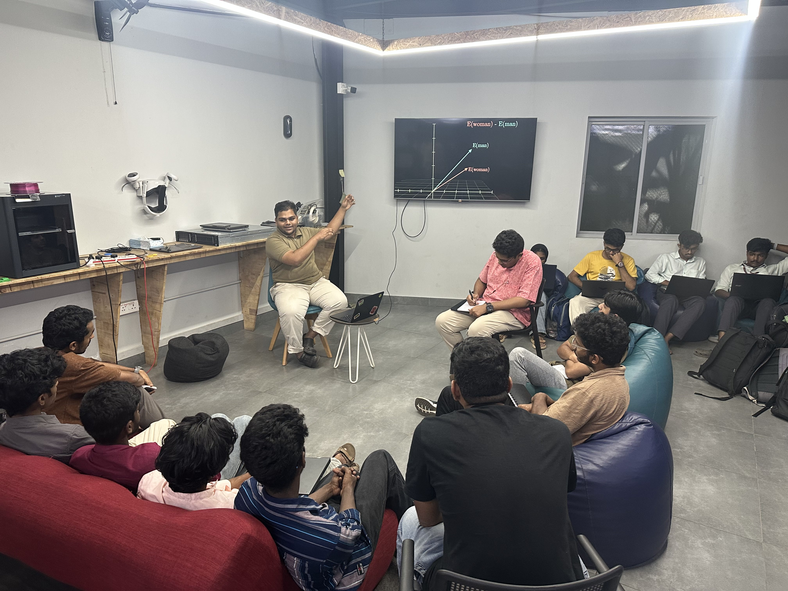
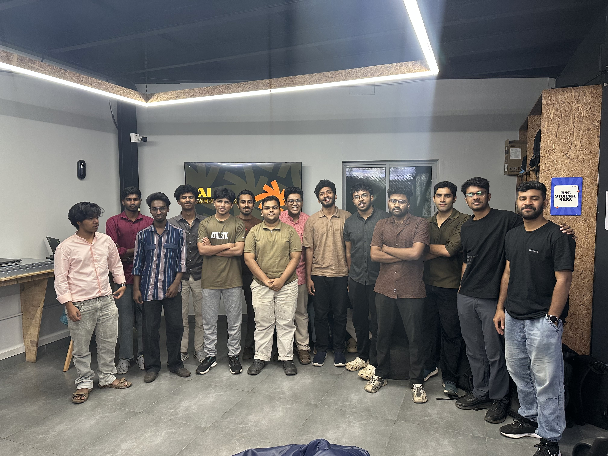

## Overview

This week’s AI Wednesday session was about understanding how modern AI models like ChatGPT actually work behind the scenes. Instead of treating AI as something magical or human-like, we broke it down into simpler ideas and mechanisms.

We started by clearing a common misconception that these models “think” or “understand” things. The discussion focused on how LLMs are trained to predict the next piece of text, and how doing this at a very large scale creates the illusion of intelligence.

The session was mostly conceptual and discussion-driven. The goal was not to teach people how to build models, but to help everyone develop a clear mental model of what is happening inside these systems.

## Topics

* Why LLMs do not think like humans and what they actually do instead
* What “next token prediction” means in simple terms
* How text is broken into tokens and converted into numbers
* What embeddings are and how they represent meaning
* A brief look at how language models evolved from simple word prediction to transformers
* What attention is and why transformers made modern AI possible
* Some important limitations of LLMs and why they sometimes fail

## Photos

## Highlights

* A major takeaway was realizing that modern AI feels intelligent not because it understands, but because it has learned patterns from huge amounts of human language.

