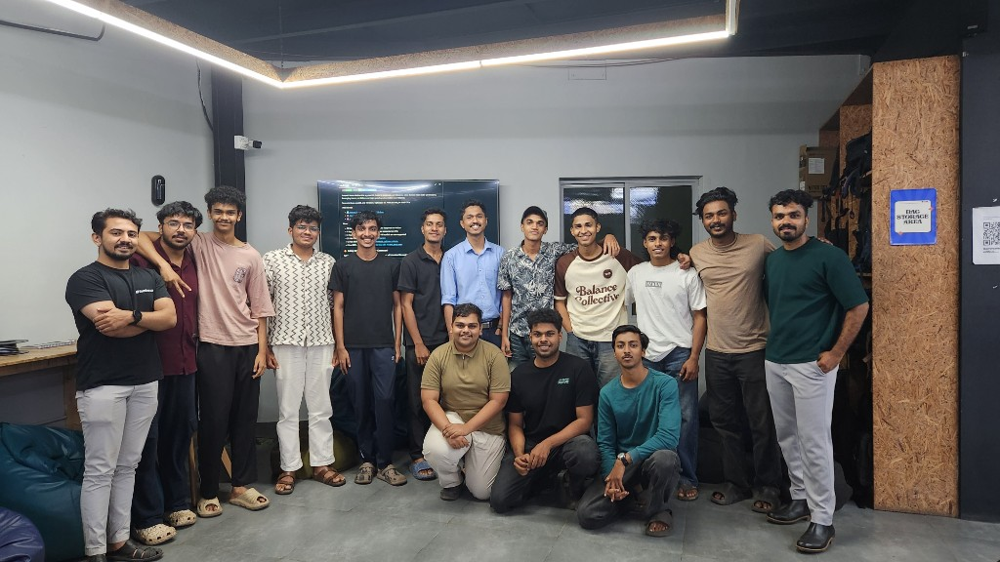

*By [Sebin Thomas](https://tinkerhub.org/@sebin) · January 28, 2026*

## Overview

This week's AI Wednesday introduced Edge AI — running machine learning directly on devices at the edge rather than in the cloud. We covered what makes edge deployment different, walked through a practical implementation on the ESP32, and discussed how quantization helps fit models onto constrained hardware.

## Topics

* What Edge AI is and why it matters for latency, privacy, and offline use
* Constraints of edge devices: memory, compute, and power
* A practical ESP32 implementation demo
* Model quantization — reducing precision to shrink models and speed up inference
* Trade-offs between model size, accuracy, and inference speed on embedded hardware

## Photos

## Highlights

* Seeing a model run on an ESP32 made the gap between cloud-scale AI and on-device inference much more tangible — quantization is often the key to bridging that gap.

## Next Week

- Topic: Exploring Mixture-of-Experts (MoE)
- Host: [Sebin Thomas](https://tinkerhub.org/@sebin)
