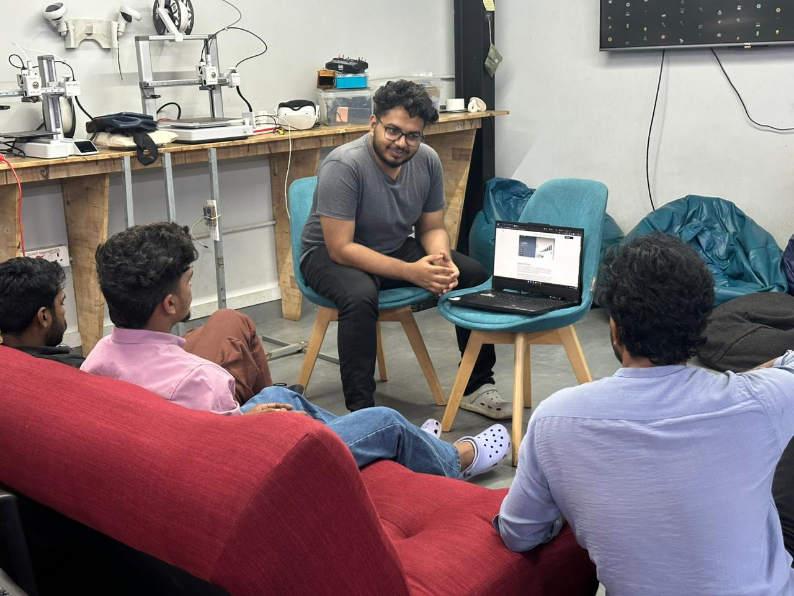

## Overview

This week’s AI Wednesday focused on Neuro-Symbolic AI, an approach that aims to combine the strengths of neural networks and symbolic reasoning. We began by discussing the limitations of current AI systems, especially their lack of true reasoning and explainability.

The session then explored how neural models (which learn from data) and symbolic systems (which use logic and rules) differ, and why integrating them is important for building more robust AI systems. The discussion was interactive, with participants questioning whether current models like LLMs truly reason or simply mimic reasoning patterns.

## Topics

### Limitations of Current AI Systems

* We started by examining where modern AI systems fall short, particularly in reasoning, consistency, and interpretability, despite strong performance in pattern recognition tasks.

### Neural vs Symbolic AI

* We discussed the fundamental differences between neural approaches (data-driven, continuous representations) and symbolic approaches (rule-based, discrete logic), and how each addresses different aspects of intelligence.

### Neuro-Symbolic Integration

* The session covered how these two paradigms can be combined, including common approaches such as neural-to-symbolic pipelines, symbolic constraints in learning, and hybrid systems that integrate reasoning directly into neural architectures.

### Representation and Reasoning Challenges

* A key focus was the difficulty of converting neural outputs into structured symbolic representations and enabling effective reasoning over them, often referred to as the symbol grounding problem.

### Applications and Use Cases

* We explored practical examples such as visual question answering, knowledge-based reasoning systems, and robotics, where combining perception and reasoning is essential.

## Photos

## Highlights

* A major takeaway was understanding that current AI systems are strong at pattern recognition but weak at explicit reasoning, and neuro-symbolic AI attempts to bridge that gap by combining learning with logic.
