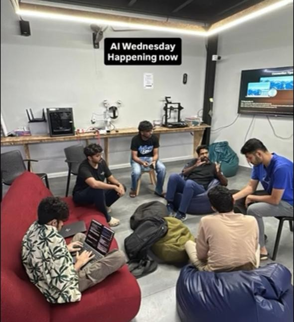

## Overview

This week's AI Wednesday looked at a new wave of sequence model architectures beyond the standard transformer. We explored Mamba's selective state space design, Google's Titans architecture for long-term memory, and the MIRAS framework that unifies how modern models handle memory, attention, retention, and online learning.

## Topics

* Mamba: selective state space models and linear-time sequence processing
* Titans: neural long-term memory with test-time memorization
* MIRAS: a framework for designing memory-driven sequence models
* How these architectures compare to transformers on long-context tasks
* The broader shift toward efficient, memory-aware sequence modeling

## Resources

* [Mamba: Linear-Time Sequence Modeling with Selective State Spaces](https://arxiv.org/abs/2312.00752)
* [Titans + MIRAS: Helping AI have long-term memory](https://research.google/blog/titans-miras-helping-ai-have-long-term-memory/) (Google Research blog)
* [Titans: Learning to Memorize at Test Time](https://arxiv.org/abs/2501.00663)
* [MIRAS: It's All Connected — A Journey Through Test-Time Memorization, Attentional Bias, Retention, and Online Optimization](https://arxiv.org/abs/2504.13173)

## Photos

## Highlights

* MIRAS provides a useful lens for understanding why so many recent architectures — from Mamba to Titans — are converging on associative memory as the core design problem.

## Next Week

- Topic: LiteRT — Google's Edge AI Runtime
- Host: [Sebin Thomas](https://tinkerhub.org/@sebin)
