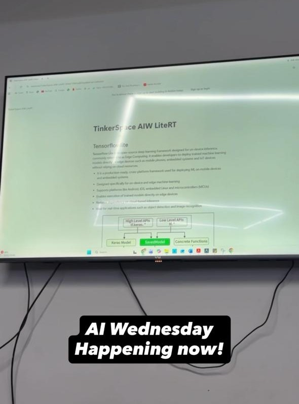

## Overview

This week's AI Wednesday explored Google's LiteRT — the runtime formerly known as TensorFlow Lite — and how libraries like it optimize models for edge deployment. We discussed what happens between a trained model and on-device inference, and why dedicated edge runtimes matter for performance on phones, microcontrollers, and embedded hardware.

## Topics

* What LiteRT is and how it fits into Google's edge AI stack
* Model conversion, delegation, and hardware acceleration on edge devices
* How runtimes optimize graphs for latency, memory, and power
* Comparing edge runtimes to cloud inference pipelines
* Practical considerations for deploying models on constrained hardware

## Resources

* [TinkerSpace AIW LiteRT (Notion)](https://lizard-feeling-2e3.notion.site/TinkerSpace-AIW-LiteRT-35feb71962ea805fad04d1eb1348b089?pvs=74)

## Photos

## Highlights

* Edge AI is not just about smaller models — the runtime and how it maps operations to hardware can matter as much as quantization.

## Next Week

- Topic: World Models
- Host: [Sebin Thomas](https://tinkerhub.org/@sebin)
