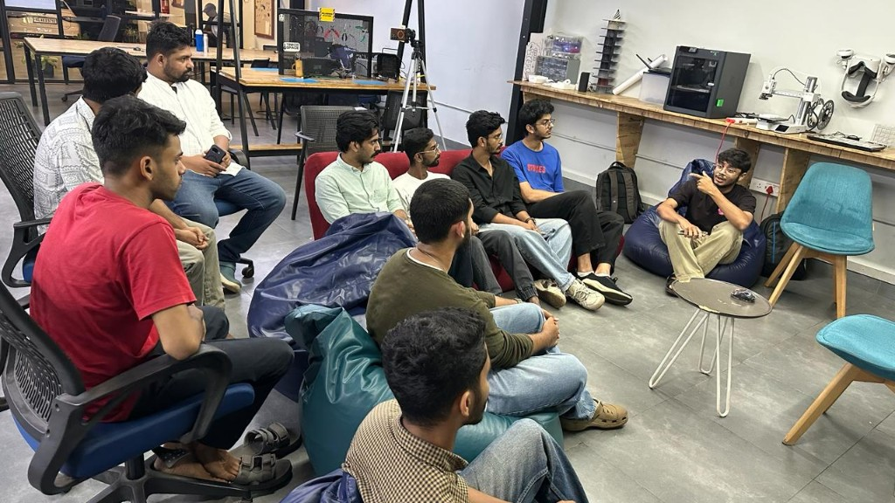

*By [Sebin Thomas](https://tinkerhub.org/@sebin) · May 27, 2026*

## Overview

This week's AI Wednesday explored world models — internal representations that let AI systems predict and simulate how environments evolve. We discussed the core idea behind world models, why they matter for planning and robotics, and surveyed some of the current implementations pushing the field forward.

## Topics

* What a world model is and how it differs from a standard predictive model
* Learning compact environment representations for simulation and planning
* How world models connect to reinforcement learning and embodied AI
* Current implementations and research directions in the field
* Applications in robotics, gaming, and autonomous systems

## Photos

## Highlights

* World models shift the focus from reacting to inputs toward understanding and predicting how environments change — a key step toward more capable agents.

## Next Week

- Topic: Neural Cellular Automata
- Host: [Sebin Thomas](https://tinkerhub.org/@sebin)
