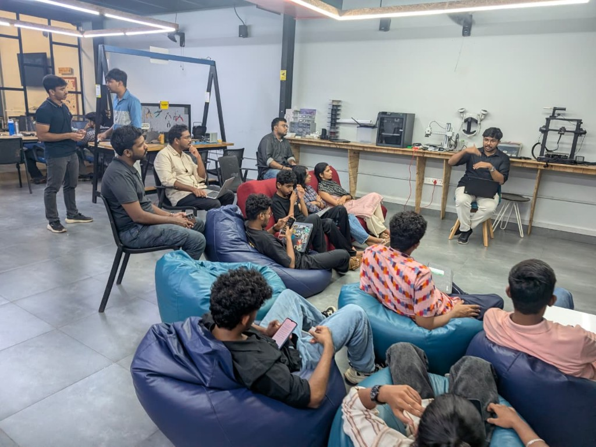

*By [Sebin Thomas](https://tinkerhub.org/@sebin) · June 10, 2026*

## Overview

This week's AI Wednesday explored Neural Cellular Automata (NCA) — systems where simple local rules, applied repeatedly, produce complex emergent behavior. We started with Conway's Game of Life as intuition, looked at playful emoji implementations, and discussed how NCAs are used in industry for tasks like texture synthesis and morphological growth.

## Topics

* What cellular automata are and how Conway's Game of Life works
* Neural Cellular Automata: learning update rules instead of hand-crafting them
* Basic emoji and pattern-generation demos
* How NCAs are applied in research and industry
* Why local, iterative updates can produce globally coherent structures

## Resources

* [Neural Cellular Automata (Notion)](https://lizard-feeling-2e3.notion.site/Neural-Cellular-Automata-37aeb71962ea809594dec540ac19cbb6)

## Photos

## Highlights

* NCAs show that complex, self-organizing behavior can emerge from very simple repeated rules — and neural networks can learn those rules rather than requiring manual design.

## Next Week

- Topic: TBD
- Host: TBD
